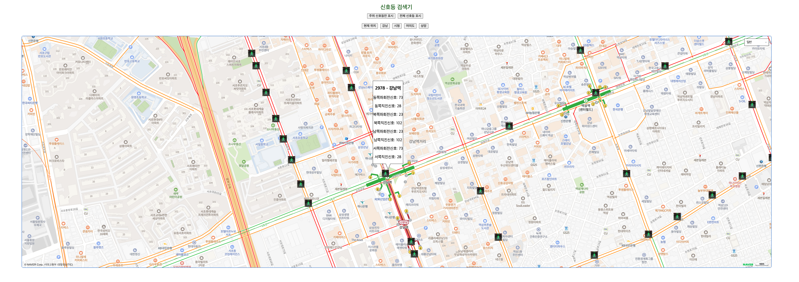

### 필요 API Key

- 네이버 Maps 이용 신청
    - https://www.ncloud.com/product/applicationService/maps
- T data OpenAPI 활용 신청
    - https://t-data.seoul.go.kr/dataprovide/trafficdataviewopenapi.do?data_id=10120
    - feign request마다 API Key 필요

## AWS ubuntu 배포

- OS : ubuntu 20.04
- JAVA : **openjdk-*17*-jdk**
    - `sudo apt install openjdk-*17*-jdk`
    - sudo nano /etc/environment 로 JAVA_HOME 추가

    ```java
    PATH="/usr/local/sbin:/usr/local/bin:/usr/sbin:/usr/bin:/sbin:/bin:/usr/games:/usr/local/games:/snap/bin"
    JAVA_HOME="/usr/lib/jvm/java-17-openjdk-amd64"
    ```

    - `source /etc/environment`로 적용 후 `echo $JAVA_HOME`으로 확인
- Docker-compose

  `docker-compose up -d`

- DB: mysql:8.2
    - `jdbc:mysql://127.0.0.1:3307/test?serverTimezone=Asia/Seoul&allowPublicKeyRetrieval=true` 맞는지 확인

    ```java
    docker run -d   
    	--name my-mysql   
    	-p 3306:3306   
    	-e MYSQL_ROOT_PASSWORD=1234
      -e MYSQL_DATABASE=test
      -e MYSQL_USER=root   
    	mysql:8.2
    ```

- Redis:latest

    ```java
    docker run -d   
      --name my-redis-container
      -p 55000:6379   
      -e REDIS_PASSWORD=redispw
      redis:latest
    ```


- Gradle 빌드

    ```java
    sudo ./gradlew build
    ```

    - gradle 에러 발생 시
        - spring-cloud-starter-config:4.0.4, spring-cloud-starter-netflix-eureka-client:4.0.3로 버전 명시해 준다.

        ```java
        implementation 'org.springframework.cloud:spring-cloud-starter-config:4.0.4'
        implementation 'org.springframework.cloud:spring-cloud-starter-netflix-eureka-client:4.0.3'
        ```

    - 빌드 후 jar이 잘 생성되었는지 확인
        - build/libs/{NAME}-SNAPSHOP.jar로 빌드
- nohup으로 실행
    - `nohup java -jar build/libs/CityLightTimer_be-0.0.1-SNAPSHOT.jar >> test.log &`
        - `CityLightTimer_be-0.0.1-SNAPSHOT.jar` : jar 파일 이름에 맞게 수정
        - `test.log` : 로그파일명

- CORS 문제 ?
    - Ajax request 호출 부분을 localhost나 127.0.0.1이 아닌 백엔드 서버 URL(공개IP)로 수정한다.
- PRIV 관련 문제 ?
    - https 인증 관련 문제
    - [https://www.notion.so/Feign-cc197bfa4bec45219dca20eb5ea6b7f4?pvs=4#b7694c2e262944e198527a45de548249](https://www.notion.so/cc197bfa4bec45219dca20eb5ea6b7f4?pvs=21)